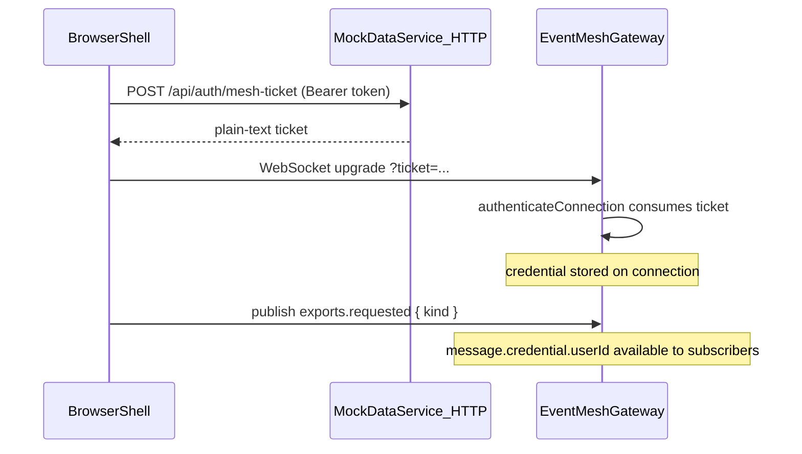

# Mesh Authentication

Connection-level authentication for the Event Mesh gateway in this showcase. Every shell that opens a WebSocket must present a valid one-time ticket; the gateway stores a server-trusted credential on the connection and attaches it to incoming messages.

Used today by authenticated CSV exports and by all three shells (ecommerce, social, admin) after login.

## Why connection-level auth

WebSocket upgrades happen once per connection. Authenticating at upgrade time means:

- The client never sends Bearer tokens or user ids inside event payloads.
- The gateway assigns `message.credential` from the server-side connection record.
- Reconnects fetch a fresh ticket via `getConnectionTicket` without changing publish code.

Per-message token passing would repeat credentials on every publish, expose tokens in browser memory on the wire, and allow payload spoofing if the server trusted client-supplied identity.

## Ticket lifecycle



### Ticket rules

| Rule | Value |
| --- | --- |
| TTL | 30 seconds |
| Use count | One-time (deleted on successful consume) |
| Response format | Plain text (not JSON) |
| Transport to gateway | Query parameter `?ticket=...` on WebSocket URL |

Tickets are issued only after validating the existing mock Bearer token (`mock-token.<userId>.<timestamp>`).

### Credential shape

After a successful upgrade, the gateway stores:

```javascript
{ userId: "user-123", roles: ["customer"] }
```

Roles are derived from `users.json`: `"admin"` → `["admin"]`, everything else → `["customer"]`.

## Server setup

### Ticket issuance

**Endpoint:** `POST /api/auth/mesh-ticket`

- Requires `Authorization: Bearer <token>`
- Returns `200` with plain-text ticket body
- Errors: `401` missing/invalid token, `404` unknown user

**Domain module:** `apps/mock-data-service/src/domain/meshTickets.js`

- `issueMeshTicket({ userId, roles })`
- `consumeMeshTicket(ticket)` → credential or `null`

**Route:** `apps/mock-data-service/src/routes/authRoutes.js`

### Gateway configuration

**Module:** `apps/mock-data-service/src/event-mesh/gatewayAuth.js`

**`authenticateConnection`** — runs during HTTP upgrade, before `clientId` assignment:

```javascript
async ({ url }) => {
  const ticket = url.searchParams.get("ticket");
  if (!ticket) return null;
  return consumeMeshTicket(ticket);
};
```

Returning `null` or throwing rejects the upgrade with HTTP `401`.

**`authorizeMessage`** — runs after message validation, before subscribers and peer rebroadcast:

| Check | Rule |
| --- | --- |
| Credential | `credential?.userId` must exist |
| Allowed publish | `exports` topic + `requested` event only |
| Everything else | Deny |

This keeps the showcase safe while admin connects to mesh without publishing business events yet.

**Wiring:** `apps/mock-data-service/src/server.js` passes both callbacks to `configureGateway()` before `gateway.start()`.

## Client setup

All three shells use the same pattern in `configureApplicationMesh()`:

```javascript
configureMesh({
  gatewayUrl: "ws://localhost",
  gatewayPort: 3004,
  enableWebSocket: true,
  getConnectionTicket: async () => {
    const authToken = localStorage.getItem(AUTH_TOKEN_STORAGE_KEY);
    if (!authToken) throw new Error("missing auth token for mesh ticket");
    return fetchMeshConnectionTicket(authToken);
  },
});
```

`fetchMeshConnectionTicket()` lives in each shell's `src/utils/authActions.js` and POSTs to `/api/auth/mesh-ticket`.

The linked `event-mesh` client calls `getConnectionTicket` on every initial connection and reconnect, then appends the ticket to the WebSocket URL.

## Session lifecycle

| Event | Shell behavior |
| --- | --- |
| Bootstrap with stored token | `configureApplicationMesh()` (+ export listeners in ecommerce/social) |
| Bootstrap without token | Mesh is not configured; no reconnect loop |
| Login (`auth:changed`) | Start mesh session only if not already started; export shells re-register listeners |
| Logout (`auth:changed`) | `mesh.close()`; export shells call `resetCsvExportListeners()` |

`configureMesh()` may run only once per mesh singleton. Bootstrap and login share `startAuthenticatedMeshSession()`, which skips re-configuration when `refreshCurrentUserFromApi` fires `auth:changed` on an already-connected session.

`mesh.close()` resets the Event Mesh singleton, so login after logout must call `configureMesh` again.

## Security notes for this showcase

- Tickets are short-lived and single-use; they must not be logged or cached beyond the upgrade.
- Query-string tickets can appear in proxy access logs — acceptable for local dev; use `wss://` and HttpOnly cookies in production where deployment allows.
- Never put `userId`, roles, or Bearer tokens in event payloads.
- Gateway credentials are not forwarded in broker envelopes (see `event-mesh` README).

## Files

| Area | Path |
| --- | --- |
| Ticket store | `apps/mock-data-service/src/domain/meshTickets.js` |
| Ticket HTTP route | `apps/mock-data-service/src/routes/authRoutes.js` |
| Gateway auth callbacks | `apps/mock-data-service/src/event-mesh/gatewayAuth.js` |
| Gateway startup | `apps/mock-data-service/src/server.js` |
| Ecommerce mesh bootstrap | `apps/ecommerce-shell/src/main.js`, `src/utils/authActions.js` |
| Social mesh bootstrap | `apps/social-media-shell/src/main.js`, `src/utils/authActions.js` |
| Admin mesh bootstrap | `apps/admin-shell/src/main.js`, `src/utils/authActions.js` |

## First feature using auth

Authenticated CSV exports use this connection credential in the gateway subscriber (`message.credential.userId`) and targeted replies via `gateway.reply()`. See [csv-exports.md](./csv-exports.md).
