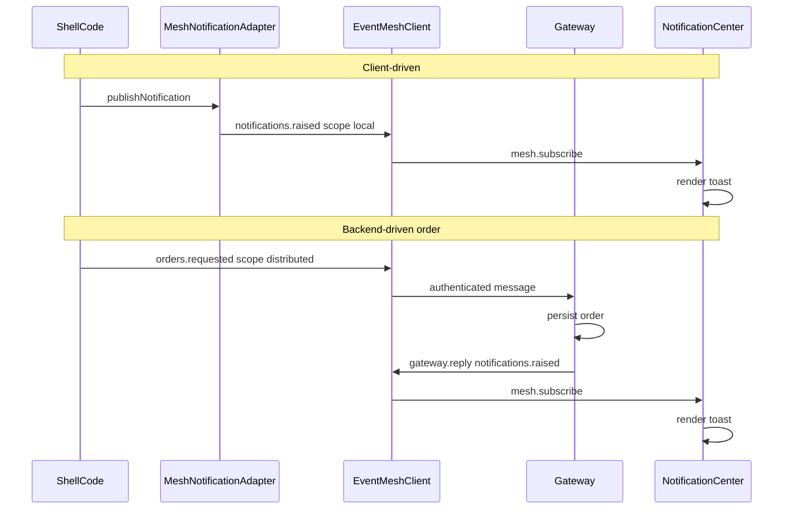

# Notifications over Event Mesh

Shell toasts render through `@shared/notifications` and each shell's persistent notification center. Producers publish `notifications.raised` on Event Mesh; the notification center subscribes to mesh directly and renders toasts. There is no CustomEvent bus or direct producer bypass.

## Why mesh end-to-end

Mesh is the sole transport for **when** a notification is raised. `mountNotificationCenter` owns **how** it is displayed by subscribing to `notifications.raised` on the same mesh client used by producers.

Two producer paths share one display subscriber:

- **Client-driven** (cart add, login, HTTP command outcomes): `publishNotification()` with `scope: "local"`
- **Backend-driven** (order placed): gateway handler replies with `notifications.raised` via `gateway.reply()`

Cross-tab fan-out for the same user is out of scope in v1. Backend replies are targeted to the requesting WebSocket client only.

## Mesh modes

| Mode | When | `configureMesh` | Capabilities |
| --- | --- | --- | --- |
| **Local** | Bootstrap logged out; after logout | `enableWebSocket: false` | Local notifications |
| **Authenticated** | Bootstrap with token; on login | `enableWebSocket: true` + `getConnectionTicket` | Local notifications + exports + orders |

Logged-out users still get toasts: local mesh is configured at bootstrap without a WebSocket or ticket.

## Flow

```text
Producer → publishNotification() or gateway.reply(notifications.raised)
Mesh → mountNotificationCenter (mesh.subscribe) → toast
```

### Client-driven example (cart add)

1. User adds a product. Shell code calls `publishNotification({ type, title, message })`.
2. The adapter publishes `notifications.raised` with `scope: "local"`.
3. The notification center's mesh subscriber receives the event and renders the toast.

This works logged in or logged out because local mesh is always started at bootstrap.

### Backend-driven example (order placed)

1. Checkout calls `placeOrderViaMesh()` after `mesh.whenConnected()`.
2. Client publishes `orders.requested` with order payload (`scope: "distributed"`).
3. Gateway handler reads `message.credential.userId`, persists the order, then `gateway.reply()` with `notifications.raised`.
4. The notification center's mesh subscriber renders the reply as a toast.



## Event contract

| Direction | Topic | Event | Payload | Delivery |
| --- | --- | --- | --- | --- |
| Client (local) | `notifications` | `raised` | `{ type, title, message, durationMs? }` | `scope: "local"` |
| Client → Gateway | `orders` | `requested` | `{ items, subtotal, discountAmount, totalAmount, appliedCoupon, shippingAddress }` | `scope: "distributed"` |
| Gateway → Client | `notifications` | `raised` | same notification payload | `gateway.reply()` |

`type` is `"success"` or `"error"`. Never embed `userId` in notification payloads.

## Shared package

[`packages/notifications/src/createMeshNotificationAdapter.js`](../packages/notifications/src/createMeshNotificationAdapter.js) exports:

- `publishNotification(notification, { scope })` — publishes through mesh

[`packages/notifications/src/mountNotificationCenter.js`](../packages/notifications/src/mountNotificationCenter.js) exports:

- `mountNotificationCenter(container, mesh)` — returns `{ unmount, ensureNotificationDisplayListeners, resetNotificationDisplayListeners }`
- Display subscribes to `notifications.raised` via `ensureNotificationDisplayListeners()`

Each shell wires producers in [`meshNotificationAdapter.js`](../apps/ecommerce-shell/src/notifications/meshNotificationAdapter.js) and display lifecycle in [`notificationCenter.js`](../apps/ecommerce-shell/src/notifications/notificationCenter.js).

## Backend files

| Area | Path |
| --- | --- |
| Order persistence | `apps/mock-data-service/src/domain/orderProcessing.js` |
| Order mesh handler | `apps/mock-data-service/src/event-mesh/orderRequestHandler.js` |
| Notification replies | `apps/mock-data-service/src/event-mesh/notificationEvents.js` |
| Gateway auth (`orders.requested`) | `apps/mock-data-service/src/event-mesh/gatewayAuth.js` |
| Order read routes | `apps/mock-data-service/src/routes/orderRoutes.js` |

`POST /api/orders` was removed. Order creation is mesh-only; GET routes remain for reads.

## Shell integration

**Bootstrap (logged out):** `startLocalMeshSession()` — `configureMesh({ enableWebSocket: false })` + `ensureNotificationDisplayListeners()`

**Bootstrap (logged in) / login:** `startAuthenticatedMeshSession()` — `mesh.close()`, reconfigure with WebSocket + ticket, re-register notification display and export listeners

**Logout:** `downgradeToLocalMeshSession()` — close authenticated mesh, restore local mesh + notification display listeners

All producers import `publishNotification` from `meshNotificationAdapter.js`. Display lifecycle (`ensureNotificationDisplayListeners` / `resetNotificationDisplayListeners`) is exported from each shell's `notificationCenter.js`.

Ecommerce checkout uses [`placeOrderViaMesh.js`](../apps/ecommerce-shell/src/commands/placeOrderViaMesh.js) for backend-driven order notifications. It maintains a separate mesh subscriber for order reply correlation only.

## Shell-local events

All shells replace their window `CustomEvent` buses with local mesh messages. They coordinate browser-local UI state only and therefore always use `scope: "local"`; they are never delivered to the gateway.

Shared auth/navigation contracts live in [`packages/shell-events`](../packages/shell-events):

| Topic | Event | Publisher | Consumer |
| --- | --- | --- | --- |
| `navigation` | `render-requested` | Navigation and route outcomes | Owning shell renderer/page reloader |
| `navigation` | `path-requested` | Shared header MFE | Owning shell `navigate(path)` |
| `navigation` | `post-login-redirect-changed` | Shell auth guards / login consume | Live observers; sessionStorage remains the tab cache |
| `auth` | `session-changed` | Sign-in, sign-out, session refresh | Owning shell mesh lifecycle and UI |
| `auth` | `logout-requested` | Shared header MFE | Owning shell session handler |

The shared header publishes through the host's Event Mesh singleton. It does not configure mesh. The social shell still observes `auth.session-changed` through `subscribeToAuthSessionChanges` so the persistent header can refresh its displayed user state.

The ecommerce shell adds cart and catalog contracts in [`apps/ecommerce-shell/src/events`](../apps/ecommerce-shell/src/events) and shared [`packages/catalog-events`](../packages/catalog-events):

| Topic | Event | Publisher | Consumer |
| --- | --- | --- | --- |
| `cart` | `item-add-requested` | Product card / product details remotes | Ecommerce cart handler; social redirects to ecommerce PDP |
| `cart` | `changed` | Ecommerce shell after a cart mutation | Header and Checkout MFE |
| `catalog` | `product-open-requested` | Product card remote | Ecommerce navigate to PDP; social `location.assign` ecommerce PDP |
| `catalog` | `filters-changed` | PLP filter store / bootstrap hydrate | Local subscribers via `subscribeToPlpFiltersChanges` |

The ecommerce shell owns the cart. Every `cart.changed` event carries a cloned `{ items: [{ productId, quantity }] }` snapshot. The Checkout MFE receives snapshots through a host-injected `subscribeToCartChanges` adapter, which uses mesh internally; it does not configure or import the mesh client. Order Details receives auth through host-injected `getAuthToken` rather than localStorage. Product remotes no longer take `onProductClick` / `onAddToCart` callbacks — details: [remote-intents.md](./remote-intents.md) and [storage-coordination.md](./storage-coordination.md).

Browser-native `popstate` and iframe `message` events remain outside these local mesh contracts.

## Related docs

- Connection auth and authorized client publishes: [mesh-authentication.md](./mesh-authentication.md)
- CSV export toasts also use `publishNotification` after mesh export outcomes: [csv-exports.md](./csv-exports.md)
- Web storage vs mesh coordination: [storage-coordination.md](./storage-coordination.md)
- Remote product intents: [remote-intents.md](./remote-intents.md)
